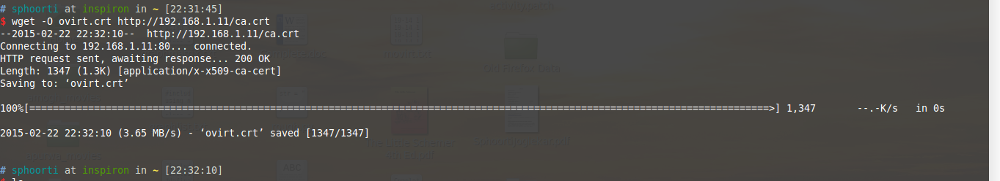
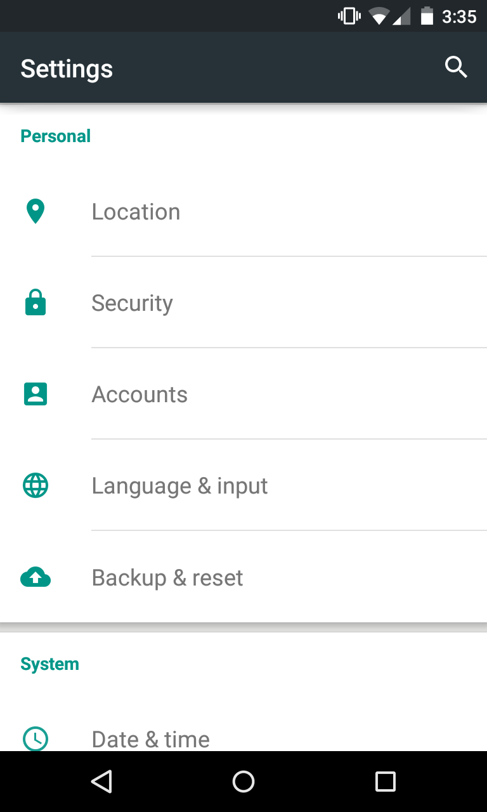
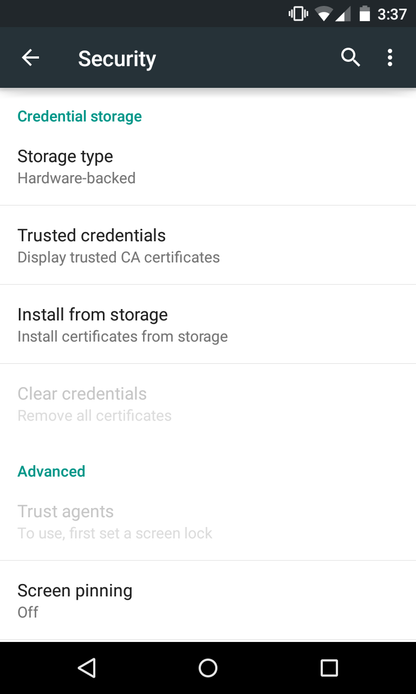
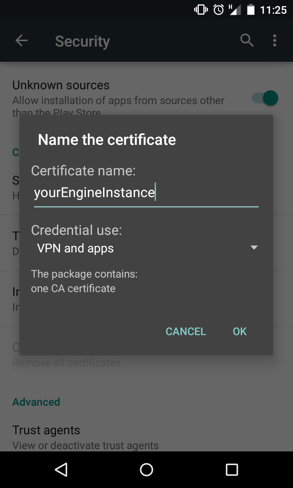
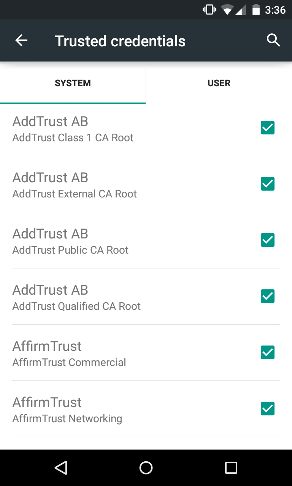

# Configuring CA certificate in Android for moVirt  

##### Getting the ovirt-engine CA on Android:  
1. Get the ovirt-engine CA certificate on your machine using the following command.  

        wget -O ${CA_FILE} http://${OVIRT}/ca.crt
where,  
${CA_FILE} is the location and name of the certificate file with .crt or .pem extension.  
${OVIRT} is the name/IP of ovirt engine.  

</img>  

Copy the downloaded certificate on your android device.  

##### Installing the ovirt-engine CA on Android:  

1. Ensure that you have a lockscreen like pattern, PIN or password for your android device. This is required to install any 'user-trusted' certificate.  
2. Navigate to **Settings - > Security -> Credential storage -> Install from storage**  
3. Select the  certificate file. A certificate manager will pop-up and ask you for the name and credential use of the certificate.  
4. Once the installation is complete, you can confirm that the certificate is present in User tab in **Settings -> Security -> Credential storage -> Trusted storage**  
Following are the screenshots that you can refer while configuring the CA certificate on your android device.  

        

     
